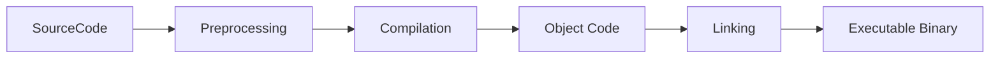

# Introduction

## C++ Compilation Process

The compilation of a C++ program involves several key stages:

---

## Visual Overview



---

## Step-by-Step Breakdown

1. **Source Code:**
   You write C++ code in `.cpp` and `.h` files.

2. **Preprocessing:**

   * Handles `#include`, `#define`, and other preprocessor directives.
   * Produces a “translation unit” with all macros expanded and headers included.

3. **Compilation:**

   * The compiler converts preprocessed code into assembly (machine instructions).
   * Output is usually an object file (`.o` or `.obj`).

4. **Object Code:**

   * The machine code generated for each source file.
   * Not yet a complete program (may contain unresolved references).

5. **Linking:**

   * Combines object files and libraries.
   * Resolves symbols (function calls, variables).
   * Produces a final executable binary.

6. **Executable Binary:**

   * The final runnable program (`.exe`, no extension on Linux, etc).

---

## Summary Diagram (Text Version)

```text
Source Code (.cpp/.h)
        |
        v
  Preprocessing (#include, #define)
        |
        v
    Compilation
        |
        v
   Object Code (.o/.obj)
        |
        v
     Linking
        |
        v
 Executable Binary
```

---

**Tip:**
You can see each stage with typical commands:

* Preprocess: `g++ -E file.cpp`
* Compile: `g++ -c file.cpp`
* Link: `g++ file.o -o file`

## References:

TODO: Add references


## General Datatypes

| Unit        | Size      | Example/Description       |
|-------------|-----------|---------------------------|
| **Bit**     | 1 bit     | 1 or 0                    |
| **Nibble**  | 4 bits    | 1011, 1010, 0000, 0101    |
| **Byte**    | 8 bits    | 10111010, 10011110        |
| **Half word** | 16 bits | 10111010 10011110         |
| **Word**    | 32 bits   | 32 bits (1's & 0's)       |
| **Double word** | 64 bits | 64 bits (1's & 0's)     |


### c++ Fundamental Data Types

| Type   |       Size         |
|--------|--------------------|
| char   | 1 byte (8 bits)    |
| int    | 4 bytes (32 bits)  |
| float  | 4 bytes (32 bits)  |
| double | 8 bytes (64 bits)  |
-------------------------------

### Derived Data Types

1. Array: Group of same-type elements (e.g., int arr[10];)
2. Pointer: Stores memory address (e.g., int* p = &n;)
3. Reference: Alias for another variable (e.g., int& ref = n;)
4. Function: Function pointers, arrays of functions, etc.

### User defined data types


1. Struct: Collection of variables (can be different types)

```cpp
struct Point { int x; int y; };
```

2. Class: Like struct, but supports encapsulation, methods, etc.
3. Union: Like struct, but all members share same memory.
4. Enum: User-defined type with set of named values (constants).

#### Struct vs Clas

| Feature        | struct | class   |
| -------------- | ------ | ------- |
| Default Access | public | private |
| Methods?       | Yes    | Yes     |
| Inheritance    | Yes    | Yes     |


### Type Modifiers

| Modifier   | Description                               | Example             |
| ---------- | ----------------------------------------- | ------------------- |
| `signed`   | Can represent negative/positive values    | `signed int x;`     |
| `unsigned` | Only positive values, higher upper limit  | `unsigned int x;`   |
| `short`    | Usually 2 bytes                           | `short int x;`      |
| `long`     | Usually 8 bytes (on 64-bit)               | `long int x;`       |
| `const`    | Value cannot change                       | `const int y = 10;` |
| `volatile` | Value can change anytime (e.g., hardware) | `volatile int v;`   |


### Type Casting

```cpp
// Implicit: 
int x = 10.5; //(x becomes 10)
// Explicit: 
float y = (float) x / 2;
```

### Special Hardware-Related Data Types

```cpp
#include <cstdint>
uint8_t a = 255;
```